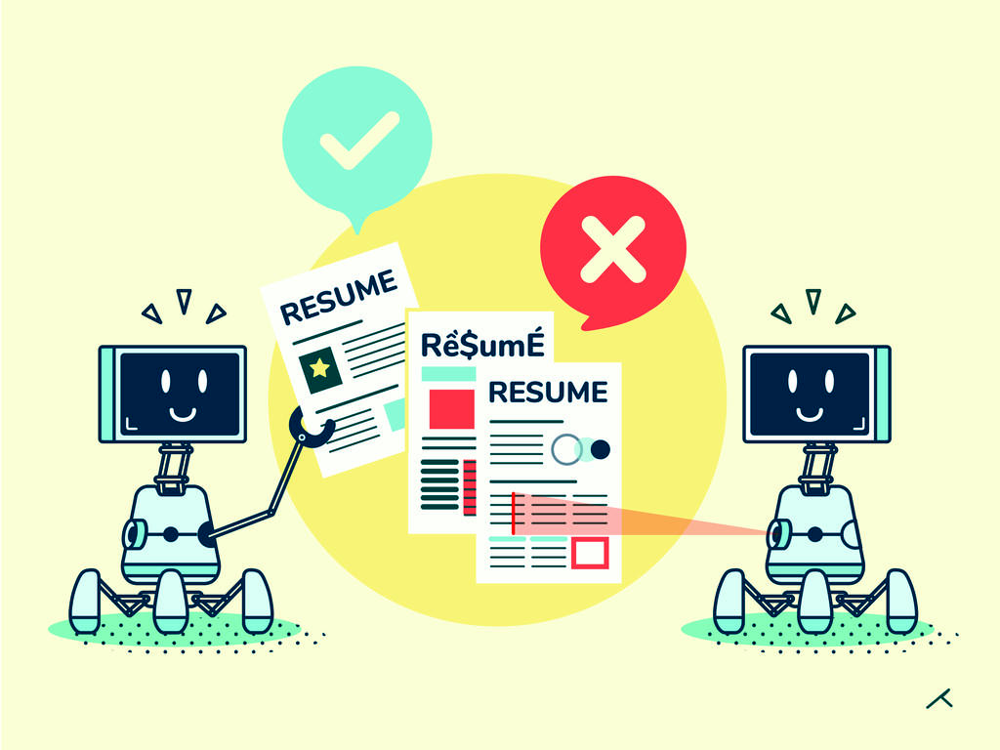

# SECTION 1 : F2M2 HR System

# SECTION 2 : EXECUTIVE SUMMARY / PAPER ABSTRACT
HR System comprised of many different modules and functions. Our project will be focusing on Recruitment management module and Scheduling & rota management module of an HR system.

After posting a job position to various job agencies, hiring manager will start receiving resumes from HR to review and select candidates. What if there are more than one position to fill in? Having to review every line in every resume to identify the potential candidates, soon becomes a chore and many valuable time is taken up to go through these resumes. One of our objectives is to help managers deal with this issue, by filtering through these resumes and find and recommend the best set of candidates.

At the same time, when HR manager upload the resume into the system, they can also check what other positions might be suitable for the submitted resume. Potentially forward it to other hiring manager for their review.

And how to perform mass staff(s) hiring? How should the manager, organize and plan out the team structure to ensure skills are matching and team budget is met. The scheduling & rota management module is set up to help manager to manage this.

# SECTION 3 : CREDITS / PROJECT CONTRIBUTION
| Official Full Name | Student ID | Work Items (Who Did What) | Email (Optional) |
| :---: | :---: | :---: | :---: |
| TEA LEE SENG | A0198538J | Create resume module, Search by cosine similarity, optaPlanner, developer guide | e0402079@u.nus.edu / TEALEESENG@gmail.com |
| NG SIEW PHENG | A0198525R  | Upload resume module, Text Pre-processing, Main project report editor & video, optaPlanner constraints tuning | e0402066@u.nus.edu |
| YANG XIAOYAN | A0056720L | Text Pre-processing, Search by KNN, optaPlanner constraints tuning, Project report | e0401594@u.nus.edu |
| Tarun Rajkumar | A0198522X | Classification model, Project report | e0402063@u.nus.edu |

# SECTION 4 : VIDEO OF SYSTEM MODELLING & USE CASE DEMO

## Developer Guide

To run Webhook server under ubuntu
1. sudo apt install git python3-venv build-essential
2. python3 -m venv IRS
3. source IRS/bin/activate
4. git clone https://github.com/XiaoyanYang2008/IRS-MRS-F2M2HRSystem.git
5. cd IRS-MRS-F2M2HRSystem
6. pip3 install -r webapp/requirements.txt
7. cd webapp/
8. python3 server.py
9. To debug, 
    - kill server.py at step 7, and 
    - runs pycharm community edition. 
    - open project on folder, IRS-MRS-F2M2HRSystemt. 
    - Mark webapps folder as Source Root, 
    - setup Project Interpreter with existing VirtualEnv" 
    - debug server.py
    - note: uses pycharm 2019.1.x. pycharm 2019.2.x needs to comments out server.py in pydevd_dont_trace_files.py under pycharm program folder. Refers bug report, https://youtrack.jetbrains.com/issue/PY-37609

To run optaPlanner under ubuntu,
1. sudo apt install maven openjdk-11-jdk-headless
2. cd optaplanner/
3. mvn dependency:copy-dependencies
4. mvn package -Dcheckstyle.skip
5. ./run.sh

